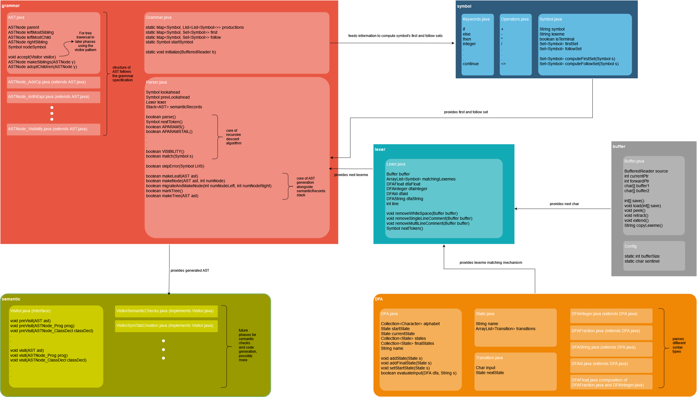

# COMPILER FRONTEND

Part of the course work for COMP442 (Compiler Design) taught by professor Joey Paquet at Concordia University.
Includes implementation of the compiler frontend (lexer, parser and AST). The following diagram shows the program 
architecture. Only the conceptually important attributes and methods are shown.

Since it is my first time implementing a compiler. The program results from a lot of trial and error and bears its
cost. I believe that after continuous improvement the frontend is now rather clean, and thus only uploaded the frontend. 
I will upload the "cleaned" backend part once no other job takes priority.